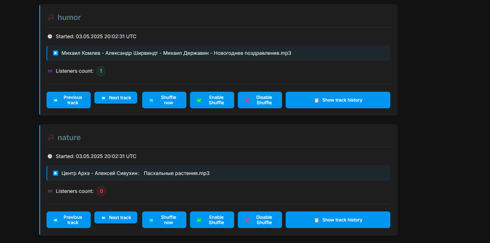

# Audio Streaming Server on Go

**Made by Aleksandr Posazhennkiov DevOps Giftery**

High-performance server for streaming audio files to a browser, written in Go. The server has minimal memory usage, supports multiple audio formats, and provides synchronized "radio-like" playback for all connected clients.

## Features

- **Memory < 100 MB** — even when streaming tracks several hours long
- **Synchronized "real radio"** — all listeners hear the same content at the same time
- **Multiple "stations"** — mapping URL paths to independent directories (e.g., `/humor`, `/news`)
- **On-the-fly playlist reload** — add or remove media files without restarting the server
- **Docker image < 20 MB** — multi-stage build with health check
- **Support for MP3, AAC, OGG formats**
- **Efficient memory usage** thanks to the use of `io.CopyBuffer` and `sync.Pool`
- **Performance monitoring** through Prometheus and Sentry
- **Graceful shutdown** upon receiving signals
- **Automatic access rights handling** — works even with files owned by root
- **Flexible shuffle settings** — can be enabled/disabled globally or per-stream
- **Status page with authorization** — protected access to information about streams and player control
- **Manual player control** — ability to switch tracks forward and backward through the web interface
- **Track history tracking** — track history is available for each station
- **Volume normalization** — automatic volume normalization across all audio tracks prevents sudden volume changes
- **Relay functionality** — relay audio streams from HTTP/HTTPS sources with web-based management

## Requirements

- Go 1.22 or higher
- Docker Engine for building Docker image

## Project Structure

The project has a modular architecture with a clear separation of responsibilities:

### Main Components

1. **`main.go`** - The main application file, contains the entry point, command line arguments processing, and initialization of all components.

2. **`audio/`** - Package for working with audio data
   - `streamer.go` - Contains the logic for streaming audio files, manages client connections and data buffering.

3. **`playlist/`** - Package for playlist management
   - `playlist.go` - Responsible for scanning directories, tracking changes in the file system, shuffling tracks, playback history.

4. **`http/`** - Package for HTTP server
   - `server.go` - Implements an HTTP server, handles requests, manages streams, and registers routes.

5. **`radio/`** - Package for managing "radio stations"
   - `radio.go` - Links playlists and audio streamers, manages playback streams.

6. **`relay/`** - Package for relaying external audio streams
   - `relay.go` - Handles relay functionality for HTTP/HTTPS audio sources.

7. **`web/`** - Web interface
   - `index.html` - HTML page with an audio player and JavaScript for interacting with the server.

8. **`entrypoint.sh`** - Script for handling access rights to audio files before launching the application.

### Additional Files

- `go.mod` / `go.sum` - Go dependency management files
- `Dockerfile` - Instructions for building a Docker image
- `docker-compose.yml` - Configuration for running via Docker Compose
- `kubernetes.yaml` - Manifest for deploying to Kubernetes

### Component Interaction

1. `main.go` loads the configuration and initializes the server
2. For each route, a `playlist.Playlist` object is created, which scans the corresponding directory
3. For each playlist, an `audio.Streamer` is created, which is responsible for reading and sending audio data
4. `radio.RadioStation` links playlists and streamers for continuous playback
5. `http.Server` creates HTTP handlers for accessing streams

## Access Rights Handling

The application automatically checks and corrects access rights to audio files at startup. The process works as follows:

1. When the container starts, the `entrypoint.sh` script is executed first
2. The script checks all mounted directories with audio files
3. If files without read permissions are detected, the script automatically adds the necessary permissions
4. This allows working with files owned by the root user without manual configuration

## Configuration

The server can be configured through command line flags or environment variables:

| Flag / ENV           | Purpose                                    | Default   |
|----------------------|--------------------------------------------|-----------|
| `--port` / `PORT`    | HTTP server port                           | `8000`    |
| `--audio-dir` / `AUDIO_DIR` | Default audio files directory        | `./audio` |
| `--stream-format` / `STREAM_FORMAT` | Stream format (mp3, aac, ogg) | `mp3`     |
| `--bitrate` / `BITRATE` | Target bitrate in kbps                  | `128`     |
| `--max-clients` / `MAX_CLIENTS` | Maximum number of simultaneous clients | `500` |
| `--log-level` / `LOG_LEVEL` | Logging level (debug, info, warn, error) | `info` |
| `--buffer-size` / `BUFFER_SIZE` | Read buffer size in bytes        | `65536` (64KB) |
| `--directory-routes` / `DIRECTORY_ROUTES` | JSON string with route-directory mapping | `{}` |
| `--shuffle` / `SHUFFLE` | Enable/disable track shuffling globally  | `false`   |
| `--per-stream-shuffle` / `PER_STREAM_SHUFFLE` | JSON string with per-stream shuffle settings | `{}` |
| `--normalize-volume` / `NORMALIZE_VOLUME` | Enable/disable volume normalization | `true` |
| `--relay` / `RELAY` | Enable/disable relay functionality | `false` |
| `--relay-config` / `RELAY_CONFIG_FILE` | Path to relay configuration file | `./relay_list.json` |
| (no flag) / `ROUTES_SHUFFLE` | Alternative for PER_STREAM_SHUFFLE with string values | `{}` |
| (no flag) / `STATUS_PASSWORD` | Password for accessing the status page | `1234554321` |
| (no flag) / `SENTRY_DSN` | Sentry DSN for error tracking | Empty (disabled) |

## Monitoring and Observability

The server provides the following endpoints for monitoring:

- **/healthz** — instantaneous 200 OK response if the server is running
- **/readyz** — checks free disk space, RAM usage, and directory availability
- **/metrics** — Prometheus metrics (number of listeners, bytes transferred, etc.)
- **/status** — password-protected page with status and control for all audio streams

## Running the Application

### Building from Source

1. Clone the repository
```bash
git clone https://github.com/aposazhennikov/stream-audio-to-web.git
cd stream-audio-to-web
```

2. Build the application
```bash
go build -o audio-streamer .
```

3. Run with default settings
```bash
./audio-streamer --audio-dir ./audio
```

4. Run with multiple "stations" from different directories
```bash
./audio-streamer --audio-dir ./audio --directory-routes '{"humor":"/home/humor","science":"/home/science"}'
```

When run with these settings, the server will create the following routes:
- `:8000/` - broadcasting audio from the `./audio` directory
- `:8000/humor` - broadcasting audio from the `/home/humor` directory
- `:8000/science` - broadcasting audio from the `/home/science` directory

When connecting to these routes in the browser, the audio stream will start automatically.

### Building and Running with Docker

1. Clone the repository
```bash
git clone https://github.com/aposazhennikov/stream-audio-to-web.git
cd stream-audio-to-web
```

2. Build Docker image
```bash
docker build -t audio-streamer:latest .
```

3. Run the container with audio directories
```bash
docker run -d --name audio-streamer \
  -p 8000:8000 \
  -v /path/to/audio:/app/audio \
  -v /path/to/humor:/app/humor \
  -v /path/to/science:/app/science \
  -v /path/to/relay_data:/app/relay_data \
  -e DIRECTORY_ROUTES='{"humor":"/app/humor","science":"/app/science"}' \
  -e SHUFFLE=false \
  -e ROUTES_SHUFFLE='{"humor":"true","science":"false"}' \
  -e STATUS_PASSWORD=your_password \
  -e SENTRY_DSN=your_sentry_dsn \
  -e RELAY=true \
  -e RELAY_CONFIG_FILE=/app/relay_data/relay_list.json \
  audio-streamer:latest
```

> **Note**: The container automatically handles access rights to audio files, so it works even with files owned by the root user.

4. Check container status
```bash
docker ps
```

5. View logs
```bash
docker logs audio-streamer
```

6. Stop the container
```bash
docker stop audio-streamer
```

### With Docker Compose

1. Create a `docker-compose.yml` file:
```yaml
version: '3.8'

services:
  audio-streamer:
    image: audio-streamer:latest
    # For working with files owned by root
    privileged: true
    ports:
      - "8000:8000"
    volumes:
      - ./audio:/app/audio
      - ./humor:/app/humor
      - ./science:/app/science
      - ./relay_data:/app/relay_data
    environment:
      - STREAM_FORMAT=mp3
      - BITRATE=128
      - MAX_CLIENTS=500
      - LOG_LEVEL=info
      - BUFFER_SIZE=65536
      - DIRECTORY_ROUTES={"humor":"/app/humor","science":"/app/science"}
      - SHUFFLE=false
      - ROUTES_SHUFFLE={"humor":"true","science":"false"}
      - STATUS_PASSWORD=your_password
      - SENTRY_DSN=your_sentry_dsn
      # Relay configuration
      - RELAY=true
      - RELAY_CONFIG_FILE=/app/relay_data/relay_list.json
    healthcheck:
      test: ["CMD", "curl", "-f", "http://localhost:8000/healthz"]
      interval: 30s
      timeout: 10s
      retries: 3
      start_period: 5s
    deploy:
      resources:
        limits:
          cpus: '1'
          memory: 256M
    restart: unless-stopped
```

2. Start
```bash
docker-compose up -d
```

3. View logs
```bash
docker-compose logs -f
```

4. Stop
```bash
docker-compose down
```

## API and Endpoints

- **`/streams`** — list of all available audio streams in JSON format
- **`/now-playing`** — information about the current track
- **`/reload-playlist`** — playlist reload
- **`/web`** — web interface with audio players
- **`/<route>`** — endpoint for listening to the audio stream
- **`/status`** — password-protected stream status page with playback control capabilities
- **`/next-track/<route>`** — move to the next track for the specified route
- **`/prev-track/<route>`** — move to the previous track for the specified route
- **`/shuffle-playlist/<route>`** — manually shuffle the playlist for the specified route
- **`/set-shuffle/<route>/on`** — enable shuffle mode for the specified route
- **`/set-shuffle/<route>/off`** — disable shuffle mode for the specified route
- **`/relay-management`** — web interface for managing relay streams
- **`/relay/stream/<index>`** — endpoint for listening to a relayed stream
- **`/relay/add`** — add a new URL to relay list
- **`/relay/remove`** — remove a URL from relay list
- **`/relay/toggle`** — enable or disable relay functionality
- **`/playlist-info`** — detailed information about the playlist (for diagnostics and testing)
- **`/healthz`** — health check endpoint that returns "OK" if the server is running
- **`/readyz`** — readiness check endpoint for Kubernetes integration

### Using curl for Track Control

You can also control track playback programmatically using curl commands with proper authentication:

```bash
# Switch to next track
curl -X POST -b "status_auth=your_password" http://server:port/next-track/route_name

# Switch to previous track
curl -X POST -b "status_auth=your_password" http://server:port/prev-track/route_name
```

Replace `your_password` with the value from your `STATUS_PASSWORD` environment variable (default is `1234554321`) and `route_name` with your stream route (e.g., `humor`, `science`).

To get a JSON response instead of being redirected to the status page, add the `ajax=1` parameter:

```bash
curl -X POST -b "status_auth=your_password" "http://server:port/next-track/route_name?ajax=1"
```

## Status Page and Playback Control

The server has a built-in web interface for monitoring and controlling audio streams, accessible at `/status`.

### Status Page Features:

- **Protected access** — login with a password set through the `STATUS_PASSWORD` environment variable
- **Status information** — display of current track, start time, and number of listeners for each station
- **Player control** — buttons for switching tracks forward and backward
- **Track history** — list of recently played tracks for each station (up to 100 tracks)
- **Stable station order** — stations are always displayed in the same order (alphabetical)
- **Relay management** — access to relay management interface when relay functionality is enabled

### Using the Status Page:

1. Open `http://server:port/status` in your browser
2. Enter the password (default `1234554321` or set via `STATUS_PASSWORD`)
3. After authorization, you will see a list of all registered audio streams
4. For each stream, the following are available:
   - "Switch back" button — go to the previous track
   - "Switch forward" button — go to the next track
   - "Show track history" button — open a list of recently played tracks

## Support for Different Directories for Different Routes

The server supports mapping URL routes and directories with audio files. This allows you to organize several "radio stations", each broadcasting its own content:

```
/home/humor    →  http://localhost:8000/humor    (humorous content)
/home/science  →  http://localhost:8000/science  (scientific content)
./audio        →  http://localhost:8000/         (main content)
```

The server automatically monitors all configured directories for changes. When new audio files are added or existing files are removed, the playlist is updated in real-time without requiring a server restart. This is implemented using the `fsnotify` library which provides file system notifications for various operating systems.

To configure the mapping, you can use:

1. Command line flag:
```bash
./audio-streamer --directory-routes '{"humor":"/home/humor","science":"/home/science"}'
```

2. Environment variable:
```bash
export DIRECTORY_ROUTES='{"humor":"/home/humor","science":"/home/science"}'
./audio-streamer
```

3. In Docker:
```bash
docker run -d -p 8000:8000 \
  -v /home/humor:/app/humor \
  -v /home/science:/app/science \
  -e DIRECTORY_ROUTES='{"humor":"/app/humor","science":"/app/science"}' \
  -e SHUFFLE=false \
  -e ROUTES_SHUFFLE='{"humor":"true","science":"false"}' \
  -e STATUS_PASSWORD=your_password \
  -e SENTRY_DSN=your_sentry_dsn \
  -e RELAY=true \
  -e RELAY_CONFIG_FILE=/app/relay_data/relay_list.json \
  audio-streamer:latest
```

## Architecture

The project has a modular architecture with a clear separation of responsibilities:

- **audio** — managing audio streams and client connections
- **playlist** — scanning directories, managing playlists and track history
- **http** — HTTP server, request handlers, and status page
- **radio** — managing "radio stations" and track playback
- **relay** — managing relay streams from external HTTP/HTTPS sources

## Performance and Features

- **RAM < 100 MB** even when serving hundreds of clients
- **CPU < 5%** on modern servers
- **Docker image size < 20 MB**
- **Peak load ~1000 parallel clients** (depends on the server)
- **Dynamic playlist updates** — add or remove audio files without restarting
- **Shuffle mode** — randomize track playback order
- **Track history** — keep track of 100 recently played tracks per station
- **Volume normalization** — automatically adjusts volume levels across all audio files to provide consistent listening experience
- **Relay functionality** — relay audio streams from HTTP/HTTPS sources with a configurable list of endpoints
- **Comprehensive healthchecks** — for reliable container orchestration

## CI/CD with GitHub Actions

The project includes GitHub Actions workflow for continuous integration and delivery:

1. On push to the `main` branch, the workflow automatically:
   - Builds a Docker image
   - Logs in to Docker Hub using repository secrets
   - Pushes the image to Docker Hub with tags:
     - `latest`
     - Git commit SHA (for versioning)

To use this CI/CD pipeline, you need to set up the following secrets in your GitHub repository:
- `DOCKERHUB_USERNAME` - Your Docker Hub username
- `DOCKERHUB_TOKEN` - Your Docker Hub access token (not your password)

This ensures that every push to the main branch results in an updated Docker image available in your Docker Hub repository.

## Testing

The project includes both unit tests and end-to-end tests:

### Unit Tests

Unit tests are located in the `unit/` directory and test individual components:
- `playlist_test.go` - Tests for playlist management functionality
- `http_test.go` - Tests for HTTP server and endpoints

To run unit tests:
```bash
go test ./unit/...
```

### End-to-End (E2E) Tests

E2E tests are located in the `e2e/` directory and test the system as a whole:
- `stream_test.go` - Tests for audio streaming functionality
- `api_test.go` - Tests for API endpoints and track control
- `status_page_test.go` - Tests for the status page and authentication
- `track_switching_test.go` - Tests for track switching functionality
- `shuffle_test.go` - Tests for shuffle mode functionality
- `playlist_update_test.go` - Tests for playlist updates when adding new files

To run E2E tests:
```bash
# Run against a local server
go test ./e2e/...

# Run against a custom server
TEST_SERVER_URL=http://yourserver:8000 go test ./e2e/...

# Run with custom auth
TEST_SERVER_URL=http://yourserver:8000 STATUS_PASSWORD=yourpassword go test ./e2e/...

# Run manual tests for file system operations (requires direct server access)
MANUAL_TEST=1 TEST_AUDIO_DIR=/path/to/audio/dir TEST_AUDIO_FILE=/path/to/test.mp3 go test ./e2e/playlist_update_test.go
```

## User Interface

The application features a modern, responsive web interface with both light and dark themes to enhance user experience.

### Status Page

The status page provides real-time information about all running radio stations, including current tracks, playback history, and listener count.

#### Light Theme


#### Dark Theme


### Authentication

Access to the status page and control features is protected by authentication to prevent unauthorized access.

#### Light Theme


#### Dark Theme


### Error Handling

The application includes user-friendly error pages for improved user experience.

#### Light Theme


#### Dark Theme


## License

MIT

# TODO 

- FIX LOGGING modes error|warn|info|debug

- FIX NORMALIZE AUDiO

- ADD LINTER STEP TO CI/CD

- FIX E2E

All tasks completed:

- Fix shuffle mode, it doesn't work right now. - DONE ✅
  - Added test to verify shuffle mode (e2e/shuffle_test.go)
  - Shuffle implementation has been checked and works correctly

- Check how it works when adding new audio to folder while stream is working. - DONE ✅
  - Added test to verify playlist updates when adding files (e2e/playlist_update_test.go)
  - The watchDirectory system successfully detects new files and updates the playlist

- Add unit tests - DONE ✅
  - Added tests for playlist and http-server

- Add e2e tests - DONE ✅
  - Added e2e tests for all main functions

- Add github actions - DONE ✅
  - Configured CI/CD with automatic testing, building and deployment

- Add routes to switch audio forward/backward (should be available by curl with specific header to protect from random internet scanners) - DONE ✅
  - Added /next-track and /prev-track endpoints with authentication checks

- Check how circle play is working, after last audio in playlist should play first one - DONE ✅
  - Circular playback works correctly

- Add HEAD http requests for monitoring (UptimeRobot has only this type of requests in free ver.) - DONE ✅
  - Added support for HEAD requests for monitoring

- Add volume normalization to prevent sudden volume changes - DONE ✅
  - Added audio normalization module for consistent volume levels
  - Implemented volume level analysis and adjustments
  - Added configuration options to enable/disable normalization
  - Created unit and e2e tests for the new functionality

- Add relay mode - DONE ✅
  - Added relay functionality to stream from external HTTP/HTTPS sources
  - Implemented web-based management interface
  - Added configuration options to enable/disable relay feature
  - Created persistent storage for relay configuration

## Shuffle Mode

The application supports automatic track shuffling with flexible configuration options:

- **Global shuffle setting** — enable or disable shuffling for all streams using the `SHUFFLE` parameter
- **Per-stream shuffle settings** — configure shuffle mode individually for each stream using the `PER_STREAM_SHUFFLE` parameter
- **Runtime control** — enable or disable shuffle mode at runtime via the status page or API
- **Automatic shuffling** — tracks are automatically randomized when the playlist is loaded
- **Periodic reshuffling** — to maintain unpredictability, the playlist is reshuffled each time it reaches the end
- **Manual reshuffling** — you can shuffle the playlist at any time via the status page or API
- **Smart reordering** — when shuffling, the system tries to maintain the current track position
- **Detailed logging** — the system logs shuffle operations for debugging purposes

### Global Shuffle Configuration

To enable shuffle mode for all streams, set the `SHUFFLE` environment variable or the `--shuffle` command line flag to `true`:

```bash
# Via command line
./audio-streamer --shuffle=true

# Via environment variable
export SHUFFLE=true
./audio-streamer

# In Docker
docker run -e SHUFFLE=true -p 8000:8000 audio-streamer:latest
```

### Per-Stream Shuffle Configuration

For more flexibility, you can configure shuffle mode individually for each stream using the `PER_STREAM_SHUFFLE` parameter as a JSON object:

```bash
# Via command line
./audio-streamer --per-stream-shuffle='{"humor":true,"science":false}'

# Via environment variable
export PER_STREAM_SHUFFLE='{"humor":true,"science":false}'
./audio-streamer

# In Docker
docker run -e PER_STREAM_SHUFFLE='{"humor":true,"science":false}' -p 8000:8000 audio-streamer:latest
```

You can also use the alternative environment variable `ROUTES_SHUFFLE` which accepts string values for shuffle settings:

```bash
# Via environment variable
export ROUTES_SHUFFLE='{"humor":"true","science":"false"}'
./audio-streamer

# In Docker
docker run -e ROUTES_SHUFFLE='{"humor":"true","science":"false"}' -p 8000:8000 audio-streamer:latest
```

This example will enable shuffle mode for the `/humor` stream while keeping the `/science` stream in sequential order, regardless of the global shuffle setting.

### Runtime Shuffle Control

You can toggle shuffle mode for any stream at runtime through the status page or API:

```bash
# Enable shuffle mode for a stream
curl -X POST -b "status_auth=your_password" http://server:port/set-shuffle/route_name/on

# Disable shuffle mode for a stream
curl -X POST -b "status_auth=your_password" http://server:port/set-shuffle/route_name/off

# Get JSON response (for API usage)
curl -X POST -b "status_auth=your_password" "http://server:port/set-shuffle/route_name/on?ajax=1"
```

You can also manually shuffle any playlist at any time without changing the shuffle mode setting:

```bash
# Manually shuffle with auth cookie
curl -X POST -b "status_auth=your_password" http://server:port/shuffle-playlist/route_name

# Get JSON response
curl -X POST -b "status_auth=your_password" "http://server:port/shuffle-playlist/route_name?ajax=1"
```

## Volume Normalization

The application includes advanced volume normalization to provide a consistent listening experience when playing audio files with different volume levels:

- **Multi-window Analysis** — analyzes multiple segments across the audio file for more accurate volume assessment
- **Smart Sampling** — intelligently samples from beginning, middle, end, and random positions to handle varying audio patterns
- **Consistent Volume Levels** — automatically adjusts volume to target -16 LUFS for all tracks
- **True Peak Limiting** — prevents clipping by monitoring and limiting true peak levels
- **Performance Optimized** — delivers first audio in under 150ms while providing accurate normalization
- **Configurable** — extensive configuration options through command line flags or environment variables
- **Caching** — analyzes each file only once and caches results for better performance
- **Intelligent Range Limiting** — prevents excessive amplification or reduction by limiting gain factors to ±12 dB
- **No Quality Loss** — normalizes audio without degrading audio quality

### Volume Normalization Configuration

Volume normalization includes several configuration options:

| Flag / ENV                     | Purpose                                      | Default |
|--------------------------------|----------------------------------------------|---------|
| `--normalize-volume` / `NORMALIZE_VOLUME` | Enable/disable volume normalization globally | `true`  |
| `--normalize-runtime` / `NORMALIZE_RUNTIME` | Runtime mode: "auto", "on", or "off"     | `auto`  |
| `--normalize-sample-windows` / `NORMALIZE_SAMPLE_WINDOWS` | Number of analysis windows per file | `6`     |
| `--normalize-sample-ms` / `NORMALIZE_SAMPLE_MS` | Duration of each analysis window in ms | `200`   |

The normalization modes work as follows:

- **auto**: Use the global setting from `NORMALIZE_VOLUME`
- **on**: Force enable normalization regardless of the global setting
- **off**: Force disable normalization regardless of the global setting

### Multi-window Analysis

The default configuration uses 6 analysis windows positioned strategically throughout the file:

1. 0% position (beginning of file)
2. 25% position (first quarter)
3. 50% position (middle)
4. 75% position (third quarter)
5. 95% position (near end)
6. Random position between 5-95%

This approach provides significantly better normalization for audio files with varying volume patterns, such as:

- Podcasts with intro silence followed by speech
- Music with quiet intros followed by louder sections
- Audiobooks with varying narrator volume
- Recordings with applause or audience sounds

For short files (under 2 seconds), the system analyzes the entire file instead.

### Examples

```bash
# Enable normalization with default settings
docker run -e NORMALIZE_VOLUME=true -p 8000:8000 audio-streamer:latest

# Disable normalization
docker run -e NORMALIZE_VOLUME=false -p 8000:8000 audio-streamer:latest

# Force enable regardless of global setting
docker run -e NORMALIZE_RUNTIME=on -p 8000:8000 audio-streamer:latest

# Use more analysis windows for better accuracy (may increase CPU usage)
docker run -e NORMALIZE_SAMPLE_WINDOWS=10 -p 8000:8000 audio-streamer:latest

# Adjust window duration for different types of content
docker run -e NORMALIZE_SAMPLE_MS=300 -p 8000:8000 audio-streamer:latest
```

The normalization process:

1. When a track is played for the first time, the system analyzes its volume using multi-window sampling
2. The average RMS and maximum true peak values are calculated across all windows
3. A gain factor is calculated to adjust the volume to the target level (-16 LUFS)
4. The gain factor is limited to a reasonable range (0.25× to 4.0×, or -12 dB to +12 dB)
5. True peak limiting is applied to prevent clipping
6. The result is stored in a memory cache to avoid repeated analysis
7. The audio data is streamed with the adjusted volume level
8. The process is repeated for each audio file, creating a consistent listening experience

## Relay Functionality

The application includes a relay feature that allows you to stream audio content from external HTTP/HTTPS sources. This is useful when you want to include streams from other services without downloading the audio files.

### Relay Features:

- **Stream external sources** — relay audio streams from any HTTP/HTTPS URL
- **Web management interface** — add, remove, and manage relay streams through a user-friendly web interface
- **Persistent configuration** — relay list is saved to a JSON file and persists across restarts
- **Authentication protected** — relay management is protected by the same authentication as the status page
- **Dark/Light theme support** — web interface respects user theme preferences
- **Integrated UI** — seamlessly integrated with the main status page

### Configuring Relay:

1. Enable relay functionality by setting the `RELAY` environment variable to `true`
2. Set the path for the configuration file using `RELAY_CONFIG_FILE` (defaults to `./relay_list.json`)
3. Mount a volume for persistent storage of the relay configuration file
4. Access the relay management interface via link on the status page or directly at `/relay-management`

### Using Relay Management:

1. Navigate to `/status` and log in with your password
2. Click on the "Relay Management" link at the top of the page
3. Use the interface to enable/disable relay functionality
4. Add new relay sources by entering their URLs in the provided form
5. Listen to relay streams directly from the management interface
6. Remove relay sources that are no longer needed

### Technical Details:

The relay functionality works by proxying requests to the external audio sources. When a client requests a relayed stream:

1. The server establishes a connection to the source URL
2. Audio data is read from the source in chunks
3. These chunks are immediately forwarded to the client
4. Headers are copied from the source to maintain format information
5. The relay supports any HTTP/HTTPS audio stream regardless of format
