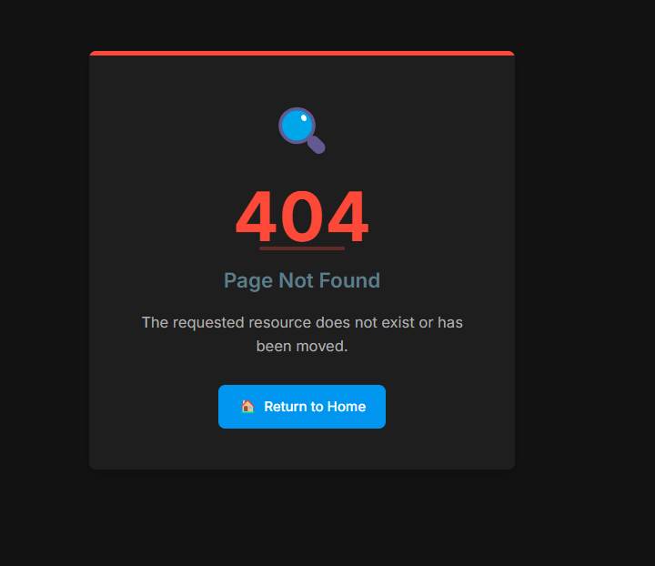

# Audio Streaming Server on Go

**Made by Aleksandr Posazhennkiov DevOps Giftery**

High-performance audio streaming server written in Go that provides synchronized "radio-like" playback for all connected clients. The server features minimal memory usage, supports multiple audio formats, and offers advanced functionality including volume normalization and relay streaming.

## ✨ Key Features

- **🚀 High Performance** — Memory usage < 100 MB even when streaming hours-long tracks
- **📻 Synchronized Radio** — All listeners hear the same content at the same time  
- **🎵 Multiple Stations** — Map URL paths to independent directories (e.g., `/humor`, `/science`, `/floyd`)
- **🔄 Hot Reload** — Add or remove media files without restarting the server
- **🐳 Docker Ready** — Multi-stage Docker image < 20 MB with health checks
- **🎧 Multi-Format Support** — MP3, AAC, OGG, WAV, FLAC audio formats
- **⚡ Efficient Memory** — Uses `io.CopyBuffer` and `sync.Pool` for optimal performance
- **📊 Monitoring** — Prometheus metrics and Sentry error tracking
- **🔀 Flexible Shuffle** — Global and per-stream shuffle configuration
- **🔐 Status Dashboard** — Password-protected web interface for stream management
- **🎛️ Manual Controls** — Switch tracks forward/backward via web interface
- **📜 Track History** — Automatic tracking of recently played tracks (up to 100 per station)
- **🔊 Volume Normalization** — Automatic volume level adjustment prevents sudden changes
- **📡 Relay Functionality** — Stream from external HTTP/HTTPS sources with web management
- **🎯 Bitrate Conversion** — Automatic conversion to target bitrate using FFmpeg
- **🏥 Health Checks** — Multiple endpoints for monitoring and readiness checks

## 🏗️ Architecture

The project uses a modular architecture with clear separation of responsibilities:

### Core Components

1. **`main.go`** - Application entry point, configuration loading, component initialization
2. **`audio/`** - Audio streaming engine
   - `streamer.go` - Manages audio streaming, client connections, and data buffering
   - `normalizer.go` - Volume normalization and audio processing
3. **`playlist/`** - Playlist management
   - `playlist.go` - Directory scanning, file system monitoring, track shuffling, history tracking
4. **`http/`** - HTTP server and web interface
   - `server.go` - HTTP server, request routing, stream management, status dashboard
   - `relay_routes.go` - Relay management endpoints
5. **`radio/`** - Radio station management
   - `radio.go` - Links playlists and streamers, manages continuous playback
6. **`relay/`** - External stream relay system
   - `relay.go` - HTTP/HTTPS stream relaying with configuration management
7. **`sentry_helper/`** - Error tracking and monitoring
   - `sentry_helper.go` - Safe Sentry integration for error reporting

### Web Interface

- **`templates/`** - HTML templates for web interface
- **`web/`** - Static web assets  
- **`image/`** - Favicon and application icons

## 🚀 Quick Start

### Using Docker Compose (Recommended)

1. **Clone the repository**
```bash
git clone https://github.com/aposazhennikov/stream-audio-to-web.git
cd stream-audio-to-web
```

2. **Build and run with your custom command**
```bash
clear && docker build -t audio-streamer:latest . && docker tag audio-streamer:latest aposazhennikov/audio-streamer:latest && docker compose up -d
```

3. **Access the application**
- Main status page: http://localhost:8000/status
- Audio streams: http://localhost:8000/floyd, http://localhost:8000/humor, etc.
- Health check: http://localhost:8000/healthz

4. **View logs**
```bash
docker compose logs
```

### Manual Docker Build

```bash
# Build image
docker build -t audio-streamer:latest .

# Run container with mounted audio directories
docker run -d --name audio-streamer \
  -p 8000:8000 \
  -v /path/to/humor:/app/humor \
  -v /path/to/science:/app/science \
  -v /path/to/floyd:/app/floyd \
  -v ./relay_data:/app/relay_data \
  -e DIRECTORY_ROUTES='{"humor":"/app/humor","science":"/app/science","floyd":"/app/floyd"}' \
  -e BITRATE=128 \
  -e MAX_CLIENTS=10 \
  -e RELAY=true \
  audio-streamer:latest
```

## ⚙️ Configuration

The server can be configured through environment variables in docker-compose.yml:

### Core Settings

| Environment Variable | Description | Default | Example |
|---------------------|-------------|---------|---------|
| `PORT` | HTTP server port | `8000` | `8000` |
| `BITRATE` | Target audio bitrate (kbps) | `128` | `128` |
| `MAX_CLIENTS` | Maximum simultaneous clients | `500` | `10` |
| `LOG_LEVEL` | Logging level | `warn` | `error`, `warn`, `info`, `debug` |
| `BUFFER_SIZE` | Read buffer size (bytes) | `65536` | `65536` |

### Directory Mapping

| Environment Variable | Description | Example |
|---------------------|-------------|---------|
| `DIRECTORY_ROUTES` | JSON mapping of routes to directories | `{"humor":"/app/humor","science":"/app/science","floyd":"/app/floyd"}` |

### Shuffle Configuration

| Environment Variable | Description | Default | Example |
|---------------------|-------------|---------|---------|
| `SHUFFLE` | Global shuffle mode | `false` | `true`, `false` |
| `SHUFFLE_SETTINGS` | Per-stream shuffle settings | `{}` | `humor:true,science:false` |

### Volume Normalization

| Environment Variable | Description | Default | Example |
|---------------------|-------------|---------|---------|
| `NORMALIZE_VOLUME` | Enable volume normalization | `true` | `false` |
| `NORMALIZE_RUNTIME` | Runtime normalization mode | `auto` | `auto`, `on`, `off` |
| `NORMALIZE_SAMPLE_WINDOWS` | Analysis windows count | `10` | `0` (disable) |
| `NORMALIZE_SAMPLE_MS` | Window duration (ms) | `1000` | `0` (disable) |

### Security & Monitoring

| Environment Variable | Description | Default | Example |
|---------------------|-------------|---------|---------|
| `STATUS_PASSWORD` | Status page password | `1234554321` | `your_secure_password` |
| `SENTRY_DSN` | Sentry error tracking DSN | Empty | `https://...@sentry.io/...` |

### Relay Configuration

| Environment Variable | Description | Default | Example |
|---------------------|-------------|---------|---------|
| `RELAY` | Enable relay functionality | `false` | `true` |
| `RELAY_CONFIG_FILE` | Relay configuration file path | `./relay_list.json` | `/app/relay_data/relay_list.json` |

## 📁 Volume Mounting

To add your audio content, mount directories to the container:

```yaml
volumes:
  # Mount your audio directories
  - /path/to/your/humor:/app/humor     # Comedy content  
  - /path/to/your/science:/app/science # Science content
  - /path/to/your/music:/app/floyd     # Music content
  - /path/to/your/other:/app/other     # Other content
  
  # Mount relay configuration (persistent)
  - ./relay_data:/app/relay_data:rw
```

**Important:** The container automatically handles file permissions, even for root-owned files.

## 🎵 Audio Formats & Processing

### Supported Formats
- **MP3** - Primary format with full feature support
- **OGG** - Ogg Vorbis with normalization support  
- **AAC** - Advanced Audio Codec support
- **WAV** - Uncompressed audio support
- **FLAC** - Lossless audio support

### Automatic Bitrate Conversion
The server automatically converts audio files to the target bitrate using FFmpeg:
- Analyzes current bitrate of each file
- Converts files that don't match target bitrate
- Maintains audio quality while ensuring consistent streaming
- Skips files that already have the target bitrate

### Volume Normalization Features
- **Multi-window Analysis** - Analyzes multiple segments for accurate volume assessment
- **Smart Sampling** - Samples from beginning, middle, end, and random positions
- **Target Level** - Normalizes to -16 LUFS for consistent volume
- **Peak Limiting** - Prevents audio clipping
- **Intelligent Range** - Limits gain adjustment to ±12 dB
- **Performance Optimized** - First audio delivered in <150ms

## 🌐 API Endpoints

### Health & Status
- `GET /healthz` - Health check (returns "OK")
- `GET /readyz` - Readiness check for Kubernetes
- `GET /status` - Password-protected status dashboard
- `GET /streams` - JSON list of all available streams
- `GET /metrics` - Prometheus metrics

### Audio Streaming
- `GET /{route}` - Stream audio from configured route
- `GET /now-playing` - Current track information
- `GET /playback-time` - Detailed playback timing info

### Playlist Management
- `POST /reload-playlist` - Reload playlists
- `POST /next-track/{route}` - Switch to next track (requires auth)
- `POST /prev-track/{route}` - Switch to previous track (requires auth)
- `POST /shuffle-playlist/{route}` - Manual shuffle (requires auth)
- `POST /set-shuffle/{route}/{on|off}` - Toggle shuffle mode (requires auth)
- `POST /clear-history/{route}` - Clear track history (requires auth)

### Relay Management
- `GET /relay-management` - Web interface for relay management
- `GET /relay/stream/{index}` - Stream from relay source
- `POST /relay/add` - Add new relay URL
- `POST /relay/remove` - Remove relay URL
- `POST /relay/toggle` - Enable/disable relay functionality

## 🔐 Authentication

Most control endpoints require authentication via cookie:

```bash
# Switch to next track
curl -X POST -b "status_auth=your_password" http://server:8000/next-track/humor

# Get JSON response
curl -X POST -b "status_auth=your_password" "http://server:8000/next-track/humor?ajax=1"
```

## 📊 Monitoring & Observability

### Prometheus Metrics
- `audio_stream_listeners` - Active listeners per stream
- `audio_bytes_sent_total` - Total bytes sent per stream  
- `audio_track_seconds_total` - Total playback time per route

### Sentry Integration
- Automatic error capture and reporting
- Performance monitoring
- Configurable via `SENTRY_DSN` environment variable

### Logging
Configure logging level via `LOG_LEVEL`:
- `debug` - Detailed debugging information
- `info` - General operational information  
- `warn` - Warning messages (default)
- `error` - Error messages only

## 🎛️ Status Dashboard

The built-in web interface provides:

### Protected Access
- Login with password set via `STATUS_PASSWORD` environment variable
- Session-based authentication with secure cookies

### Stream Management
- Real-time status of all registered audio streams
- Current track display with elapsed/remaining time
- Active listener count for each stream
- Track history (last 100 tracks per station)

### Playback Control
- Next/Previous track buttons for each station
- Manual playlist shuffling
- Enable/disable shuffle mode per stream
- Clear track history

### Relay Management
- Add/remove external audio stream URLs
- Enable/disable relay functionality
- Real-time stream status checking
- Direct streaming from relay sources

## 🔀 Shuffle Mode

Flexible shuffle configuration with multiple levels:

### Global Configuration
```bash
# Enable shuffle for all streams
-e SHUFFLE=true
```

### Per-Stream Configuration
```bash
# Configure shuffle per stream
-e SHUFFLE_SETTINGS="humor:true,science:false"
```

### Runtime Control
```bash
# Enable shuffle for specific route
curl -X POST -b "status_auth=password" http://server:8000/set-shuffle/humor/on

# Manually shuffle playlist
curl -X POST -b "status_auth=password" http://server:8000/shuffle-playlist/humor
```

## 📡 Relay Functionality

Stream audio from external HTTP/HTTPS sources:

### Configuration File Format
```json
[
  "http://example.com:8000/stream1",
  "https://radio.example.com/stream2.mp3",
  "https://icecast.example.org/radio128"
]
```

### Management Features
- **Web Interface** - Add/remove streams via browser
- **Persistent Storage** - Configuration saved to JSON file
- **Status Monitoring** - Real-time stream availability checking
- **Authentication** - Same login as status page

### Access Relay Streams
- Management: http://localhost:8000/relay-management
- Stream: http://localhost:8000/relay/stream/0 (index from relay list)

## 🎨 User Interface

The application features a modern, responsive web interface with both light and dark themes for enhanced user experience.

### Status Dashboard

The status page provides real-time information about all running radio stations, including current tracks, playback history, and listener count.


### Authentication

Access to the status page and control features is protected by authentication to prevent unauthorized access.

#### Light Theme


#### Dark Theme


### Error Handling

The application includes user-friendly error pages for improved user experience.

#### Light Theme


#### Dark Theme


## 🧪 Testing

### Unit Tests
```bash
go test ./unit/...
```

### End-to-End Tests
```bash
# Local testing
go test ./e2e/...

# Against custom server
TEST_SERVER_URL=http://yourserver:8000 go test ./e2e/...

# With custom authentication
TEST_SERVER_URL=http://yourserver:8000 STATUS_PASSWORD=yourpassword go test ./e2e/...
```

### Test Coverage
- Audio streaming functionality
- API endpoints and authentication
- Track switching and shuffle mode
- Playlist updates and file system monitoring
- Status page and relay management
- Volume normalization

## 🔧 Development

### Building from Source
```bash
# Clone repository
git clone https://github.com/aposazhennikov/stream-audio-to-web.git
cd stream-audio-to-web

# Build application
go build -o audio-streamer .

# Run with configuration
./audio-streamer --directory-routes '{"humor":"./humor","science":"./science"}'
```

### Dependencies
- Go 1.22+
- FFmpeg (for bitrate conversion and duration detection)
- Docker Engine (for containerized deployment)

## 🚢 Deployment

### Docker Compose Production
```yaml
services:
  audio-streamer:
    image: aposazhennikov/audio-streamer:latest
    container_name: audio-streamer
    privileged: true  # For root-owned files
    ports:
      - "8000:8000"
    volumes:
      - /media/humor:/app/humor
      - /media/science:/app/science  
      - /media/music:/app/floyd
      - ./relay_data:/app/relay_data:rw
    environment:
      - BITRATE=128
      - MAX_CLIENTS=50
      - LOG_LEVEL=warn
      - DIRECTORY_ROUTES={"humor":"/app/humor","science":"/app/science","floyd":"/app/floyd"}
      - SHUFFLE=false
      - NORMALIZE_VOLUME=true
      - NORMALIZE_RUNTIME=auto
      - STATUS_PASSWORD=your_secure_password
      - SENTRY_DSN=your_sentry_dsn
      - RELAY=true
      - RELAY_CONFIG_FILE=/app/relay_data/relay_list.json
    healthcheck:
      test: ["CMD", "curl", "-f", "http://localhost:8000/healthz"]
      interval: 30s
      timeout: 10s
      retries: 3
      start_period: 5s
    deploy:
      resources:
        limits:
          cpus: '1'
          memory: 256M
    restart: unless-stopped
```

### Kubernetes Deployment
```yaml
apiVersion: apps/v1
kind: Deployment
metadata:
  name: audio-streamer
spec:
  replicas: 1
  selector:
    matchLabels:
      app: audio-streamer
  template:
    metadata:
      labels:
        app: audio-streamer
    spec:
      containers:
      - name: audio-streamer
        image: aposazhennikov/audio-streamer:latest
        ports:
        - containerPort: 8000
        env:
        - name: DIRECTORY_ROUTES
          value: '{"humor":"/app/humor","science":"/app/science"}'
        - name: BITRATE
          value: "128"
        volumeMounts:
        - name: humor-volume
          mountPath: /app/humor
        - name: science-volume
          mountPath: /app/science
        livenessProbe:
          httpGet:
            path: /healthz
            port: 8000
          initialDelaySeconds: 30
          periodSeconds: 10
        readinessProbe:
          httpGet:
            path: /readyz
            port: 8000
          initialDelaySeconds: 5
          periodSeconds: 5
      volumes:
      - name: humor-volume
        hostPath:
          path: /media/humor
      - name: science-volume
        hostPath:
          path: /media/science
```

## 📈 Performance Characteristics

- **Memory Usage:** < 100 MB even with hours-long tracks
- **CPU Usage:** < 5% on modern servers
- **Docker Image:** < 20 MB (multi-stage build)
- **Peak Load:** ~1000 parallel clients (server dependent)
- **Latency:** First audio delivered in < 150ms
- **File Support:** Hot-swap without restart

## 🤝 Contributing

1. Fork the repository
2. Create your feature branch (`git checkout -b feature/amazing-feature`)
3. Commit your changes (`git commit -m 'Add some amazing feature'`)
4. Push to the branch (`git push origin feature/amazing-feature`)
5. Open a Pull Request

## 📄 License

This project is licensed under the MIT License - see the [LICENSE](LICENSE) file for details.

## 🙏 Acknowledgments

- Built with Go for high performance and reliability
- Uses Gorilla Mux for HTTP routing
- Integrates Prometheus for monitoring
- Features Sentry for error tracking
- Powered by FFmpeg for audio processing
